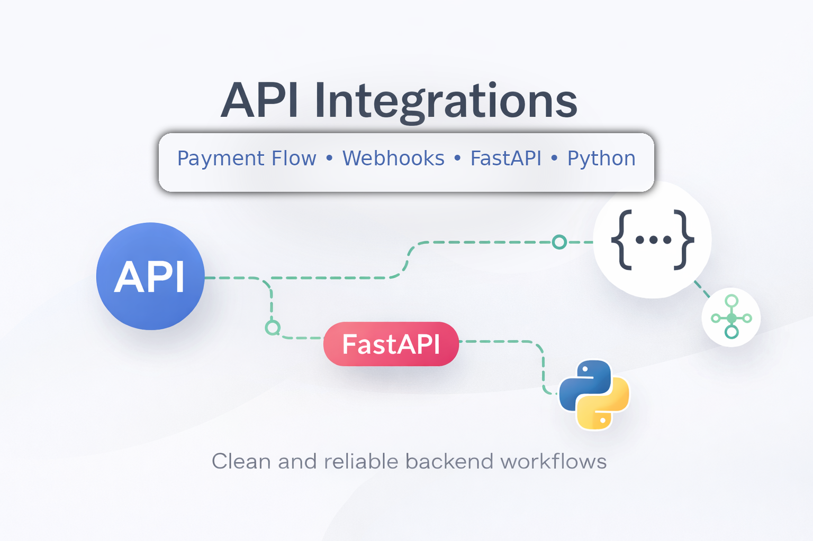

# API Integration Workflow Demo with ECPay Stage Checkout and Slack Notifications

A minimal FastAPI project that demonstrates a practical payment integration and IM notification workflow.

This version is prepared for direct deployment from GitHub to Railway so you can share a live demo link with clients. It upgrades the earlier demo by storing events in SQLite, using UUID-based event IDs, and changing the ECPay result page to a reload-safe POST → Redirect → GET flow.

## Demo Preview

This project demonstrates a practical payment integration workflow built with FastAPI, ECPay stage checkout, persistent event tracking, and Slack notifications.

- Live Demo: [Demo URL](https://api-integration-workflow-demo-production.up.railway.app/)
- Video Preview: [Watch the demo in Releases](../../releases/latest)

## What this demo shows

- Payment flow integration with ECPay stage checkout
- Server-side callback confirmation via webhook
- Persistent status tracking with SQLite
- Final paid-state verification
- Slack notification after confirmed payment

## Demo flow

1. Create a demo order  
2. Generate a payment event  
3. Redirect to ECPay hosted checkout  
4. Complete the test payment + OTP flow  
5. Receive server-side callback  
6. Update final payment status  
7. Send Slack notification after confirmation

## Live Demo

- **Demo URL:** [Home](https://api-integration-workflow-demo-production.up.railway.app/)
- [Demo Video](docs/demo.mp4)

## What this project demonstrates

- API request handling with FastAPI
- ECPay stage credit checkout integration
- `CheckMacValue` verification for server callbacks
- SQLite-backed persistent event tracking
- Reload-safe payment status pages using POST -> Redirect -> GET
- Optional Slack incoming webhook notification after confirmed payment
- Recent event lookup for repeatable live demos

## Why earlier V4 update matters

The previous in-memory demo could lose state after a Railway restart and could confuse users when a browser reload created a new event flow. This version fixes that by:

- storing events in `data/demo.db`
- generating globally unique `event_id` values
- keeping `event_id` in the result page URL
- surfacing recent events on the home page
- letting users resume status checks for the same payment after reloads

## Demo scenario

1. A client creates a demo order
2. The backend stores a persistent local event in SQLite
3. The backend prepares an ECPay stage checkout form
4. The client completes payment on ECPay's hosted checkout page in stage mode
5. The browser returns to a reload-safe result page
6. ECPay sends a server-side callback to the backend
7. The backend updates the final payment status
8. If enabled, the backend sends a Slack notification to the demo owner's channel
9. The result page shows the latest payment status and notification summary

## Main endpoints

- `GET /`
- `GET /health`
- `POST /api/integrations/orders`
- `GET /api/integrations/events/{event_id}`
- `GET /api/integrations/events?limit=8`
- `POST /api/payments/ecpay/checkout`
- `POST /api/integrations/webhooks/ecpay/return`
- `POST /payments/ecpay/result`
- `GET /payments/ecpay/result?event_id=...`
- `GET /payments/ecpay/redirect/{event_id}`

## ECPay stage environment

No real payment is processed.

Recommended stage test values:

- Card number: `4311-9522-2222-2222`
- CVV: `222`
- Expiry date: any future date
- OTP: `1234` if prompted
- Currency: `TWD` only

## Slack notifications
Slack notifications are optional and intended for the demo owner. Users do not need their own Slack setup. When enabled, the app sends a message to your Slack channel only after the ECPay server callback confirms payment. The result page also shows whether the notification was sent successfully.

## What this project showcases

- Payment integration workflow design
- Hosted checkout redirection with a Taiwanese payment provider
- Callback verification and event handling
- Practical fixes for async callback UX in demos
- Reload-safe result tracking
- Stable cloud demo behavior with SQLite persistence
